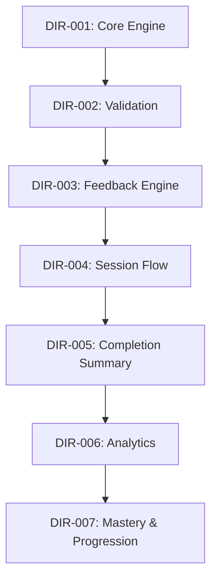

# DIR-IMPLEMENTATION-PLAN-001

## Directions V1 Implementation Plan

Status: Frozen

Scope source: `docs/DIR-FREEZE-001.md`  
Verification source: `docs/DIR-TEST-001.md`

---

## 1. Purpose

This document defines the canonical implementation sequence for the Directions V1 activity family. 
The roadmap is structured to ensure:
- **Incremental Implementation**: Build the activity in small, testable slices.
- **Independent Testing**: Every packet has discrete validation criteria and unit/UI runners.
- **Learner-First Development**: Milestones are defined by complete learner interactions.
- **Small, Reviewable Packets**: Minimize risk and ensure reviews remain focused.

---

## 2. Implementation Principles

- **One Feature Per Packet**: Each step focuses on a single functional target.
- **Independently Testable**: A packet is not complete until its corresponding unit/UI tests run and pass.
- **No Scope Expansion**: Discovery of new requirements or edge cases must be logged in the backlog rather than expanding the active packet.
- **Preserve Architecture Freeze**: Strictly conform to boundaries set in `docs/DIR-FREEZE-001.md`.
- **Preserve Learner Flow**: Keep the learner's interactive loop primary at all milestones.

---

## 3. Learner Journey Milestones

Each implementation packet must directly build toward or complete one of the following learner milestones:

```text
1. Hub (Home page launches iframe)
   ↓
2. Launch (Directions frame loads state)
   ↓
3. Learn (Arrow and prompt choices displayed to learner)
   ↓
4. Feedback (Local correct/wrong highlights trigger)
   ↓
5. Session Complete (All trials finished)
   ↓
6. Completion Summary (Metrics persist and summary displays)
   ↓
7. Exit / Replay (Try Again resets; Home returns to Hub)
```

---

## 4. Packet Roadmap

### DIR-001: Core Direction Engine
- **Purpose**: Render the basic spatial direction frame.
- **In Scope**:
  * 2x2 grid layout containing direction option cards.
  * Target direction model (Up, Down, Left, Right representation).
  * High-contrast arrow icons.
  * Basic instruction prompt placeholder.
- **Out Of Scope**: Selection click handling, trial advancing, audio/TTS, analytics, result screen.
- **Done Means**:
  * Arrow directions render correctly matching target variables.
  * Choice cards are laid out in a grid.
  * Unit tests confirm coordinate generation.
- **Milestone Completed**: *3. Learn* (Layout/Arrow rendering).
- **Dependencies**: None.

---

### DIR-002: Direction Validation
- **Purpose**: Allow the learner to tap buttons and validate selections.
- **In Scope**:
  * Tap event handlers on option cards.
  * Comparison logic (Learner selection vs. Target direction).
  * Trial-level correct vs. wrong state flag updates.
  * Advancing to the next target direction on correct selection.
- **Out Of Scope**: Sound effects, styling animations, session scoring, persistent metrics.
- **Done Means**:
  * Tapping the correct card advances to a new direction trial.
  * Tapping incorrect cards flags a retry state without advancing.
- **Milestone Completed**: *4. Feedback* (Tap logic and validation).
- **Dependencies**: `DIR-001`

---

### DIR-003: Feedback Engine Integration
- **Purpose**: Connect visual and auditory feedback.
- **In Scope**:
  * Correct selection: plays standard click sound, highlights card.
  * Wrong selection: triggers standard orange pulse animation on the selected card.
  * Correct-answer dwell delay (800-1000ms pause) before advancing to allow feedback absorption.
- **Out Of Scope**: Celebration banners, level transitions, TTS.
- **Done Means**:
  * Selection triggers correct sound or orange retry animation.
  * Tests verify feedback timing parameters.
- **Milestone Completed**: *4. Feedback* (Animations & Audio).
- **Dependencies**: `DIR-002`

---

### DIR-004: Session Flow
- **Purpose**: Manage session lifecycle across a block of trials.
- **In Scope**:
  * Trial counter (8 to 12 trials per session).
  * Core session state model (tracking elapsed time, mistake counts, correct answers).
  * Completion hook triggered when the final trial completes.
- **Out Of Scope**: Persistent saving, result metrics UI.
- **Done Means**:
  * Completing 10 trials stops gameplay and triggers session-over events.
- **Milestone Completed**: *5. Session Complete*.
- **Dependencies**: `DIR-003`

---

### DIR-005: Completion Summary
- **Purpose**: Display the final metrics and offer replay/exit routes.
- **In Scope**:
  * Persistent completion result card layout within the frame.
  * Try Again button (resets state, seeds fresh randomized session).
  * Home button (communicates exit to SIRAASH shell).
  * Saving session summary payload to IndexedDB.
- **Out Of Scope**: Live telemetry aggregator updates, parent dashboard metrics.
- **Done Means**:
  * Completed sessions render scores, corrections, and time taken.
  * Clicking replay works, and home returns to hub.
- **Milestone Completed**: *6. Completion Summary*, *7. Exit / Replay*.
- **Dependencies**: `DIR-004`

---

### DIR-006: Analytics Foundation
- **Purpose**: Capture and aggregate telemetry for skill mapping.
- **In Scope**:
  * Record accuracy, mistakes, prompts, direction types, and response times in trials.
  * Extend `AnalyticsAggregator` to resolve the Directions game ID and map domains/skills.
  * Add developer warnings for unknown telemetry IDs.
- **Out Of Scope**: Historical performance trends, parental dashboard UI.
- **Done Means**:
  * Core analytics tests verify aggregator aggregates directions data without data loss.
- **Milestone Completed**: *6. Completion Summary* (Database & Telemetry).
- **Dependencies**: `DIR-005`

---

### DIR-007: Mastery & Progression
- **Purpose**: Implement cognitive mastery evaluations.
- **In Scope**:
  * Retrieve historical directions results from IndexedDB.
  * Evaluate mastery status (stable high accuracy + baseline reaction speed).
  * Implement progression eligibility flags (automatic level promotion remains disabled for V1 parent control audit).
- **Out Of Scope**: Fluency timers, parent sandbox controls.
- **Done Means**:
  * Unit tests verify that historical logs trigger correct mastery status updates.
- **Milestone Completed**: *7. Exit / Replay* (Mastery evaluations).
- **Dependencies**: `DIR-006`

---

## 5. Dependency Matrix



---

## 6. Deferred Features

The following features are excluded from V1 and remain in the backlog:
- Multi-step directions (Level 4+).
- Opposite-direction rules (Level 5+).
- Diagonal directions.
- Live speed timer pressures.
- Adaptive fluency engines.
- Parent Practice Lab controls.
- Voice/speech recognition inputs.

---

## 7. Definition of V1 Complete

Directions V1 is complete when:
1. The learner can successfully launch and play a 10-trial single-step direction recognition session (Up/Down/Left/Right).
2. Tapping displays correct sound/colour or orange retry animation feedback.
3. Telemetry records to IndexedDB and aggregates via `AnalyticsAggregator`.
4. A persistent completion summary card renders scores, errors, and Try Again/Home actions.
5. Historical results correctly feed the V1 mastery evaluation engine.
6. All automated unit and UI integration tests pass.

---

## 8. Lessons Adopted from Schulte

To ensure platform uniformity, Directions V1 adopts the following standards from the Schulte Table:
- **Completion Summary Persistence**: Summaries remain visible in the viewport and never auto-close.
- **Worksheet Result Pattern**: Result screens match the structure, metrics cards, and font scaling of the SIRAASH Worksheet Standard.
- **Shared Feedback Engine**: Utilize standard audio clips and orange pulse css rules.
- **Shared Analytics Contract**: Telemetry fields map exactly to the domain and cognitive target registry.
- **Mastery Before Promotion**: Progression rules are evaluated on historical consistency, not single-session completion.
- **Activity Standards**: Shell frames clip contents cleanly, hide parent navigation, and handle messages securely.
